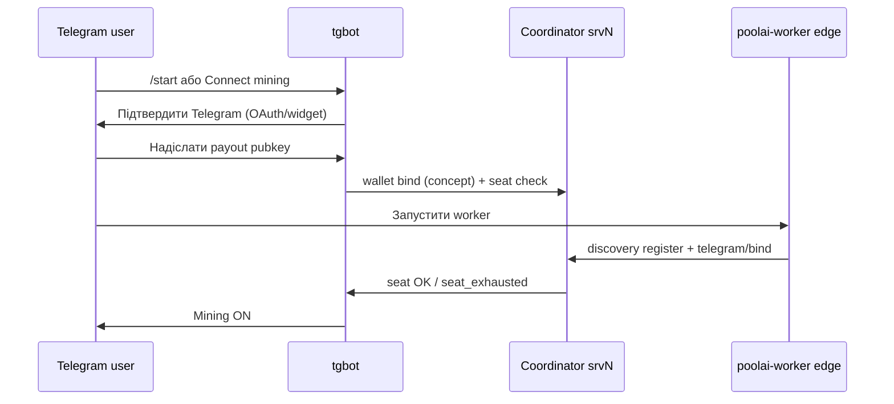

# PoolAI Galaxy Grid (концепт v1)

## Коротко

**Galaxy Grid** — це глобальна, федеративна мережа інстансів PoolAI (srvN), де:

1. **Адмін srvN** підключає свої ресурси (host/VM, Cloud через API провайдера, можливі власні VM worker’и).
2. **Telegram-клієнти** вмикають mining на своїй стороні (в чаті), отримують винагороди за виконані job’и.
3. **Клієнти ШІ** споживають інференс через веб-інтерфейс гріду (через будь-який домен), який маршрутизує job на доступні worker’и.
4. **Grid** обирає “де виконувати” job з урахуванням ресурсів, locality та вартості, а якщо на srvN все зайнято — робить **re-migrate** туди, де з’явився вільний capacity.

Цей документ — продуктово-архітектурна специфікація рівня концепту/протоколу (без деталей UI/E2E), узгоджена з наявними модулями: **virtual nodes (FM-016)**, **RAID/SmallWorld**, **Jobs**, **VM isolation**, **Telegram bot** та **Solana adapter (sidecar)**.

## 1. Ролі та економіка

### 1.1 Засновник / dev (primary fee)

- У коді PoolAI є **primary dev wallet**.
- **Primary dev fee = 0.1%** (незмінна комісія для засновника).

### 1.2 Адмін srvN (secondary fee + керування)

- Адмін піднімає PoolAI srvN (hub/coordinator) і керує:
  - власними worker’ами та їх ресурсними лімітами (CPU/GPU/RAM/Disk);
  - інтеграціями з провайдерами (K8s/EC2/Azure тощо) через свій API доступ у межах свого srvN;
  - розміщенням worker’ів як VM/isolated instances.
- **Secondary fee = 1–5%** (рекомендація: чим менше — тим краща ринкова конкурентність).
- При “без Telegram-пулу” адмін заробляє собі secondary fee, віддаючи job лише primary (0.1%) dev’у.

#### 1.2.1 Payout formula (PH-S58, canonical)

Усі суми в **atomic units** (наприклад SOL **lamports**). Відсотки — **floor** (округлення вниз), basis points `bps` (100% = 10_000 bps):

| Fee | bps | Share |
|-----|-----|-------|
| Primary dev | 10 | 0.1% (fixed) |
| Secondary admin | 100–500 | 1–5% (admin config) |
| Worker / operator pool | remainder | gross − primary − secondary |

```
primary   = floor(gross × 10 / 10_000)
secondary = floor(gross × secondary_bps / 10_000)   // secondary_bps ∈ [100, 500]
worker    = gross − primary − secondary
```

**Приклад (1 SOL = 1_000_000_000 lamports, secondary = 1%):**

- primary = 1_000_000 lamports (0.001 SOL)
- secondary = 10_000_000 lamports (0.01 SOL)
- worker pool = 989_000_000 lamports (0.989 SOL)

**Приклад (1 SOL, secondary = 5%):** worker pool = 949_000_000 lamports (0.949 SOL).

**UX rule (admin UI):** показувати hint *«Lower secondary fee (1–5%) improves market competitiveness; higher fee reduces worker payout.»* при зміні secondary fee.

**Rust reference:** `src/grid/galaxy_fee_split.rs` — `split_gross_payment`, unit tests + `cargo bench --bench galaxy_fee_split_benchmarks`.

### 1.3 Telegram-клієнт (mining worker edge)

- Telegram-користувач підключає **payout wallet** (Solana pubkey) для винагороди — у чаті через tgbot або linked UI (§3.2).
- Якщо в каналі підключені Telegram worker’и, то сукупна винагорода майнінгу розподіляється так:
  - primary dev fee = 0.1% завжди;
  - secondary fee (встановлена адміном srvN) — переходить адмінам srvN;
  - решта винагороди — на **payout wallet** власника активного seat/session (після `galaxy_fee_split`).
- **Seat cap:** одночасно активних `origin=telegram_edge` worker’ів для `(srv_id, telegram_chat_id)` не більше **`seat_limit`** (§3.1).

### 1.4 Клієнт ШІ (споживач інференсу)

- Це користувач, який отримав “адресу”/endpoint від адміна srvN або через discovery гріду.
- Він:
  - заходить у web UI з **будь-якого домену** (типовий ingress + cookie/session);
  - створює job на інференс;
  - оплачує виконання (billing/settlement на стороні srvN).

> Примітка: конкретний вибір “який саме IDE/white-label UI” лишається відкритим; це не впливає на мережевий контракт job’ів.

## 2. Модель worker’ів і discovery

### 2.1 Уніфікована сутність “worker / virtual-node”

Рекомендована модель: **одна сутність** у discovery (наприклад `virtual-nodes / workers`), але з полями:

- `origin`: `local_srv` | `cloud_provider` | `telegram_edge`
- `admin_id` / `srv_id`: кому належить цей capacity
- `capabilities`: GPU/CPU/Memory/Disk, підтримка тасків, prefetch-профіль
- `network_profile`: latency/topology/white-ip/vpn+proxy параметри (для routing)
- `limits`: скільки worker реально готовий “віддати” (manual cap або auto)

У UI/API ці параметри можна показувати фільтрами/лейблами, без дублювання сутностей.

### 2.2 Auto-scale та capacity allocation

Worker’и мають:

1. **Auto-pick** (залежно від навантаження srvN та/або власної внутрішньої метрики worker’а).
2. **Manual cap**: адміністратор може задати, скільки ресурсів worker реально віддає гріду.
3. **Telegram edge cap**: `active_telegram_edge_workers ≤ seat_limit` (§3.1; політика seats задається адміном каналу).

Для CPU/GPU worker’ів авто-розкладка може відрізнятись, але контракт має бути однаковим: “скільки capacity доступно зараз”.

### 2.3 DTO sketch (discovery/grid) + UI labels

Для уніфікації local/cloud/telegram worker пропонується єдиний wire DTO:

```json
{
  "worker_id": "wrk_01H...",
  "srv_id": "srv_eu_west_1",
  "admin_id": "admin_42",
  "origin": "local_srv",
  "status": "online",
  "capabilities": {
    "cpu_cores": 8,
    "gpu_units": 1,
    "memory_gb": 32,
    "disk_gb": 512,
    "task_profiles": ["inference:text", "inference:vision"]
  },
  "network_profile": {
    "region": "eu-west",
    "latency_ms_p50": 24,
    "bandwidth_mbps": 500,
    "egress_policy": "vpn_proxy"
  },
  "limits": {
    "max_concurrent_jobs": 4,
    "max_gpu_jobs": 1,
    "manual_cap_enabled": true
  },
  "telemetry": {
    "queue_depth": 1,
    "load_avg_1m": 0.42,
    "last_heartbeat_at": "2026-05-26T23:00:00Z"
  }
}
```

Нормативні поля:

- `origin`: `local_srv` | `cloud_provider` | `telegram_edge`.
- `admin_id` + `srv_id`: ownership і білінг-маршрутизація.
- `capabilities`: scheduler contract для підбору задач.
- `network_profile`: routing/locality/SmallWorld сигнали.
- `limits`: ручні або auto caps для admission control.

Мінімальні правила UI (admin/ops панель):

1. Показувати `origin` як badge (`local`, `cloud`, `telegram`) у списку worker-ів.
2. Фільтри: `origin`, `region`, `gpu_units > 0`, `status`.
3. Сортування за `latency_ms_p50` і `last_heartbeat_at` (дефолт для troubleshooting).
4. Розкритий рядок worker-а: ownership (`admin_id`, `srv_id`) + caps (`max_concurrent_jobs`, `max_gpu_jobs`).

## 3. Telegram edge mining: worker як “VM-aware” isolated capacity

Telegram worker (desktop Win/Linux/Mac) має працювати як:

- worker-агент в ізоляції (VM/containment під контролем PoolAI VM/Isolation layer);
- з probros до ресурсів host’а (GPU пізніше, наразі CPU/RAM/Disk у режимі “cold mining” або без GPU passthrough).

Усі параметри mining worker’а (payout wallet, seat, винагорода, fee split) мають керуватись **всередині Telegram чату**; tgbot — оркестратор UX і викликів coordinator API.

### 3.1 Worker seats (PH-S60, canonical)

**Seat** — право тримати **одного** одночасно активного `telegram_edge` worker’а в межах `(srv_id, telegram_chat_id)`.

Три пов’язані, але **різні** лічильники (не плутати):

| Поняття | Що рахує | Роль у Galaxy Grid |
|---------|----------|-------------------|
| **Channel members** | учасники Telegram-чату/каналу | верхня «соціальна» межа; lurker не споживає seat |
| **Bound wallet** | унікальний `payout_pubkey`, прив’язаний до `telegram_user_id` у чаті | **білінгова ідентичність** для settlement |
| **Active session** | worker з `origin=telegram_edge`, heartbeat OK, lease допускає job | **runtime** споживач seat |

**Рекомендована політика (default `bound_wallet_session`):**

```
seat_limit = min(admin_max_seats, bound_wallets_count_in_chat)
active_telegram_edge_workers ≤ seat_limit
```

- `admin_max_seats` — конфіг адміна srvN на канал (наприклад 10, 50, 100).
- `bound_wallets_count_in_chat` — кількість **verified** payout wallets у scope чату (не всі members).
- **1 bound wallet → 1 seat** у default policy (один користувач не тримає два concurrent edge worker’и на той самий payout).

**Альтернативні політики** (адмін обирає на канал):

| Policy ID | `seat_limit` | Коли використовувати |
|-----------|--------------|----------------------|
| `member_cap` | `min(admin_max_seats, member_count)` | простий MVP; слабкий anti-abuse |
| `bound_wallet_cap` | `min(admin_max_seats, bound_wallets_count)` | **рекомендовано** для mining/payout |
| `session_cap` | `admin_max_seats` (лише runtime) | коли wallets ще не зібрані; лише ліміт одночасних процесів |

**Admission при перевищенні:** новий register/heartbeat `telegram_edge` → `409 seat_exhausted` (концепт); tgbot показує *«Усі seats зайняті; від’єднайте worker або збільште ліміт у адміна.»*

**Wire sketch (coordinator state, концепт):**

```json
{
  "srv_id": "srv_eu_1",
  "telegram_chat_id": "-1001234567890",
  "seat_policy": "bound_wallet_session",
  "admin_max_seats": 32,
  "bound_wallets_count": 12,
  "seat_limit": 12,
  "active_telegram_edge_workers": 5
}
```

### 3.2 Wallet binding flow (PH-S60, minimal)

Мета: зв’язати **`telegram_user_id` → `peer_id` (worker) → `payout_pubkey` (settlement)** у чаті, без окремого web-only onboarding.

**Існуючий код (FM-016+):**

- `POST /api/v1/virtual-nodes/telegram/bind` — `{ telegram_user_id, peer_id, chat_id? }` → `TelegramBinding` (`src/services/virtual_node_telegram_binding_service.rs`).
- `poolai-worker` з `POOLAI_TELEGRAM_ID` викликає bind після register.
- Discovery register може передати `metadata.telegram_id` / `telegram_chat_id`.

**Розширення концепту (наступні спринти, не PH-S60 code):** `POST /api/v1/virtual-nodes/telegram/wallet` — `{ telegram_user_id, chat_id, payout_pubkey, chain: "solana" }`.

#### Кроки UX (мінімальний flow)



| Крок | Дія | Результат |
|------|-----|-----------|
| 1 | Користувач у **каналі srvN** → `/start` або inline **Connect mining** | `chat_id` + `telegram_user_id` відомі боту |
| 2 | **Verify identity** — Telegram Login Widget / OAuth (`oauth2_telegram_*`) або trusted `from.id` у webhook | `telegram_user_id` підтверджено |
| 3 | **Bind payout wallet** — pubkey (base58) або Connect wallet | `payout_pubkey` per `(srv_id, chat_id, telegram_user_id)` |
| 4 | **Seat pre-check** — `bound_wallets_count < seat_limit` | інакше stop + повідомлення в чаті |
| 5 | Запуск **edge worker** (`poolai-worker`, `POOLAI_TELEGRAM_ID`, `POOLAI_COORDINATOR_URL`) | register → `POST .../telegram/bind` |
| 6 | Coordinator: `origin=telegram_edge`; fee split §1.2.1 | винагорода → `payout_pubkey` |

**Правила безпеки (концепт):**

- Pubkey **не** приймається з неверифікованого `from.id` у публічних групах без кроку 2.
- Зміна `payout_pubkey` — re-verify + cooldown (наприклад 24h) або admin override.
- Один `telegram_user_id` — один активний `peer_id` bind (re-bind перезаписує, старий peer offline).

**tgbot команди (концепт):**

| Команда | Дія |
|---------|-----|
| `/start` | welcome + seat policy hint |
| `/wallet <pubkey>` | bind payout (після verify) |
| `/status` | seat_limit, active workers, bound wallet |
| `/stop` | unbind + graceful worker stop hint |

**Env (worker, наявне):** `POOLAI_TELEGRAM_ID`, `POOLAI_COORDINATOR_URL` — див. `HANDOFF` §2a.

## 4. Grid scheduling, re-migration та pricing

### 4.1 Global routing policy

Grid є **глобальною мережею**: srvN можуть існувати де завгодно; адмінам надається механізм підключення своїх endpoint’ів у грід через VPN/proxy/white-IP домени.

Scheduling має враховувати:

- доступні worker capabilities;
- network_profile (latency/topology, пропускна здатність);
- locality (seed/memory shard placement та “де вже є потрібні шари”);
- pricing.

### 4.2 Pricing oracle (PH-S59, canonical)

Galaxy Grid використовує **pricing oracle** — off-chain компонент coordinator/srvN, який:

1. збирає публічні або адмін-конфігуровані **unit-ціни** US inference-провайдерів;
2. обчислює **ринковий мінімум** по профілю задачі;
3. публікує **PoolAI quote** = **−10%** від цього мінімуму (округлення вниз);
4. кешує котирування з **TTL** і переходить на **fallback** при outage джерел.

Oracle **не** замінює settlement (`galaxy_fee_split` / on-chain); він лише визначає **gross quote** для job до fee split.

#### 4.2.1 Unit ціни (нормалізація)

Білінг і scheduling мають спільний словник **unit keys**. Кожен provider quote нормалізується до цих ключів перед `min()`.

| Unit key | Сенс | Типові job / capability |
|----------|------|-------------------------|
| `inference_input_token` | USD за 1M **input** токенів | `inference:text`, chat completion |
| `inference_output_token` | USD за 1M **output** токенів | те саме (окремий output тариф) |
| `inference_blended_token` | USD за 1M **blended** токенів (якщо провайдер не ділить in/out) | legacy/API без split |
| `gpu_second` | USD за 1 GPU-секунду | `inference:vision`, GPU batch |
| `job_flat` | фіксована ціна за job | короткі/sync задачі, cap на ризик |

**Канонічний primary unit для порівняння US min:** `inference_blended_token` (або пара `input`+`output`, якщо обидва є в каталозі — тоді `effective = input + expected_output_ratio × output`).

**Нормалізація валюти:** усі котирування oracle зберігає в **micro-USD** (`usd_micro`, 1 USD = 1_000_000 usd_micro) для цілочисельної арифметики; конвертація в lamports/SOL — на етапі settlement (курс окремо, поза scope oracle).

**Приклад provider row (концепт):**

```json
{
  "provider_id": "openai_us",
  "region": "us",
  "model_profile": "gpt-4o-mini",
  "task_profiles": ["inference:text"],
  "units": {
    "inference_input_token": 150000,
    "inference_output_token": 600000
  },
  "observed_at": "2026-05-26T12:00:00Z",
  "source": "public_list_price"
}
```

(`150000` usd_micro = $0.15 / 1M tokens.)

#### 4.2.2 Формула: −10% від min US providers

**US provider set** (конфігурований каталог, `region = us`):

- OpenAI, Anthropic, xAI (Grok), Mistral, Google (US endpoints), інші з allow-list адміна гріду.
- Провайдер **healthy**, якщо останній успішний fetch &lt; `provider_stale_after_secs` (default 600).

Для заданого `task_profile` + `model_profile` (або default profile):

```
market_min_usd_micro = min(provider[i].normalized_unit_price)   // i ∈ US, healthy
poolai_quote_usd_micro = floor(market_min_usd_micro × 9_000 / 10_000)   // −10%, floor
```

**Приклад:** min blended = $0.50 / 1M → `market_min = 500_000` usd_micro → `poolai_quote = floor(500_000 × 0.9) = 450_000` ($0.45 / 1M).

**Job gross (концепт):** coordinator оцінює expected units (tokens з request, GPU-seconds з capability) × `poolai_quote` → `gross_usd_micro` → далі `galaxy_fee_split` на atomic settlement units.

#### 4.2.3 Кеш і TTL

| Параметр | Default | Призначення |
|----------|---------|-------------|
| `cache_ttl_secs` | 300 | Свіжість entry; після TTL — async refresh |
| `max_stale_secs` | 3600 | Stale-while-revalidate: віддавати застарілий кеш, поки refresh у flight |
| `refresh_jitter_pct` | 10 | Розмазати refresh між srvN, щоб не DDoS-ити провайдерів |

**Ключ кешу:** `(task_profile, model_profile, unit_key)` → `{ poolai_quote_usd_micro, market_min_usd_micro, provider_id_at_min, observed_at, cache_fresh_until }`.

**Поведінка:**

1. **Hit (fresh):** повернути кеш без мережі.
2. **Hit (stale, &lt; max_stale):** повернути кеш + фоновий refresh (SWR).
3. **Miss / expired stale:** синхронний refresh; при success — оновити кеш; при fail — fallback (§4.2.4).

Майбутній wire (концепт): `GET /api/v1/grid/pricing?task_profile=…&model_profile=…` — read-only snapshot для admin UI і AI-клієнта.

#### 4.2.4 Fallback при outage

Якщо **усі** US джерела недоступні або quotes невалідні:

| Рівень | Умова | Дія |
|--------|-------|-----|
| **L1 — stale cache** | є last-known-good, вік &lt; `max_stale_secs` | використати stale; metric `galaxy_pricing_stale_served` |
| **L2 — configured floor** | `POOLAI_GALAXY_PRICING_FALLBACK_JSON` або per-profile floor у config | зафіксований `poolai_quote` (адмін оновлює вручну при довгому outage) |
| **L3 — hard stop** | L1+L2 недоступні | **нові** priced jobs → `503 pricing_unavailable`; running jobs — без зміни gross; ops alert |

**Операторський override:** `POOLAI_GALAXY_PRICING_FORCE_FALLBACK=1` — завжди L2 (аварійний режим, логувати `pricing_forced_fallback`).

**Не робити:** автоматично підвищувати ціну понад `market_min` під час outage (зберігаємо обіцянку −10% від останнього відомого min або L2 floor).

#### 4.2.5 Ops notes (coordinator)

| Змінна (концепт) | Default | Опис |
|------------------|---------|------|
| `POOLAI_GALAXY_PRICE_CACHE_TTL_SECS` | `300` | TTL свіжого кешу |
| `POOLAI_GALAXY_PRICE_MAX_STALE_SECS` | `3600` | Межа stale-while-revalidate |
| `POOLAI_GALAXY_PRICING_PROVIDERS` | bundled allow-list | JSON/TOML каталог US providers + endpoints |
| `POOLAI_GALAXY_PRICING_FALLBACK_JSON` | — | L2 floor quotes per `task_profile` |
| `POOLAI_GALAXY_PRICING_FORCE_FALLBACK` | `0` | `1` = лише L2 |

**Спостережність:**

- Логи: `pricing_oracle_refresh_ok`, `pricing_oracle_refresh_fail`, `pricing_oracle_stale_served`, `pricing_oracle_outage`.
- Метрики (Prometheus, майбутнє): `galaxy_pricing_cache_age_seconds`, `galaxy_pricing_provider_errors_total`, `galaxy_pricing_quote_usd_micro`.
- Alert: усі providers fail &gt; 15 хв **і** L2 не заданий → сторінка ops.

**Реалізація (наступні спринти):** окремий модуль `src/grid/galaxy_pricing_oracle.rs` (не в scope PH-S59); PH-S59 — лише контракт і ops.

**Rust reference (fee split, не oracle):** `src/grid/galaxy_fee_split.rs` — застосовується після визначення `gross`.

### 4.3 Re-migrate policy

Якщо srvN прийняв job, але:

- усі його worker’и зайняті,

то job не чекає безкінечно; він **re-migrate** у той srvN, де з’явився вільний capacity.

#### 4.3.1 Job lease / TTL (at-most-once)

Для кожного job вводиться `lease_owner` (srv/worker), `lease_epoch` і `lease_expires_at`.

- `lease_ttl`: базовий час володіння lease (наприклад 30-120 с, профільно за типом job).
- `lease_renew_interval`: heartbeat/renew до `lease_ttl/3`.
- `lease_epoch`: монотонний номер lease; новий власник отримує більший epoch.

Правило виконання:

1. Worker може стартувати execution **лише** якщо має активний lease і локальний `lease_epoch` збігається з поточним в coordinator state.
2. Будь-який старий lease (менший epoch або expired) не має права публікувати фінальний результат.
3. Публікація result приймається тільки для активного lease-epoch (CAS-перевірка по `job_id + lease_epoch`).

Це дає at-most-once на рівні “accepted result”, навіть якщо попередній worker ще живий мережево.

#### 4.3.2 Мінімальна state-модель job

Рекомендований мінімум:

- `Submitted` -> `Queued`
- `Leased` (owner + epoch + expires_at)
- `Running`
- `Completed` | `Failed` | `Cancelled`
- `Migrating` (технічний перехід між lease owner)

Дозволені переходи:

- `Queued -> Leased` (первинний pick)
- `Leased/Running -> Migrating -> Leased` (re-migrate на нового owner)
- `Leased/Running -> Failed` (retry budget вичерпано або policy stop)
- `Running -> Completed` (успішне завершення під актуальним epoch)

#### 4.3.3 Failover trigger та retry budget

Re-migrate запускається, якщо виконується хоча б один trigger:

- `lease_expired` (немає renew до `lease_expires_at`);
- `worker_unhealthy` (health-check fail N разів підряд);
- `queue_starvation` (job занадто довго не стартував у `Leased`);
- `capacity_preemption` (owner втратив необхідний capability профіль).

Retry budget:

- `max_migrations_per_job` (наприклад 3-5);
- `max_total_runtime` (глобальний upper bound життєвого циклу job);
- backoff policy між міграціями (linear/exponential з jitter).

Після вичерпання budget job переводиться у `Failed` з reason-кодом (`lease-timeout`, `worker-unhealthy`, `budget-exhausted`).

## 5. Seeds / shards / locality-aware placement

Узгоджено з [`POOLAI_MEMORY_LAYER.md`](./POOLAI_MEMORY_LAYER.md) (seed = нода з shard) і wire у `src/grid/` (`MemoryShard`, `emit_seed_provided` / `emit_memory_updated`).

### 5.1 Семантика seeds (канон)

| Шар | Що це | Приклад ID / джерело |
|-----|--------|----------------------|
| **Memory shard** | логічний шар AGI-памʼяті (ембедінги, checkpoint) | `shard_id` у `MemoryShardStore`, `GET /api/v1/memory/shards` |
| **RAID artifact** | фізичний носій / репліка shard | `artifact_id`, `POOLAI_RAID_BASE_PATH` |
| **Hot layer** | копія shard у RAM/VRAM worker’а для low-latency read | локальний cache, не замінює RAID source of truth |
| **Seed provider** | worker/srvN, що віддає shard іншим (`SeedProvided`) | `peer_id` + `seed_inventory` (концепт, §5.4) |

**Правило Galaxy Grid:** scheduler (§4.1) враховує `required_shard_ids` job’а + **де вже є hot/local replica**, перш ніж тягнути дані через WAN.

### 5.2 Locality placement (PH-S61, canonical)

**Мета:** *keep hot layers local* — виконувати job там, де потрібні шари вже в hot tier або в одному SmallWorld-кільці з низьким egress.

**Placement score** (концепт, off-chain, coordinator):

```
locality_score(worker, job) =
    w_shard  × shard_local_hit(worker, job.required_shard_ids)
  + w_lat    × latency_factor(worker.network_profile)
  + w_hot    × hot_tier_hit_ratio(worker, job.task_profile)
  - w_egress × estimated_cross_region_egress_mb(job)
```

| Сигнал | Діапазон | Сенс |
|--------|----------|------|
| `shard_local_hit` | 0..1 | частка `required_shard_ids`, присутніх у `seed_inventory` worker’а |
| `latency_factor` | 0..1 | `1 / (1 + latency_ms_p50/100)` з `network_profile` (§2.3) |
| `hot_tier_hit_ratio` | 0..1 | частка required bytes уже в RAM/VRAM hot tier |
| `estimated_cross_region_egress_mb` | ≥0 | штраф за pull з іншого `region` |

**Політика вибору worker (разом із pricing §4.2):**

1. Відфільтрувати за `capabilities` + `limits` + seat cap (§3.1).
2. Сортувати за `locality_score` (desc), потім `pricing`, потім `queue_depth`.
3. Якщо `shard_local_hit = 0` для всіх — **replicate-or-fetch**: SmallWorld short-path до найближчого seed provider, потім optional **re-migrate** job після prefetch (§4.3).

**SmallWorld (high level):** реплікація shard за RAID-політикою; routing обирає peer з мінімальним hop-count + egress; деталі топології — RAID/SmallWorld docs, не дублювати тут.

**Wire extension (worker DTO, концепт):**

```json
"seed_inventory": {
  "shard_ids": ["w:emb-1", "w:ckpt-7"],
  "hot_tier": {
    "ram_bytes_used": 3221225472,
    "vram_bytes_used": 0,
    "profiles": ["inference:text"]
  },
  "local_replica_regions": ["eu-west"],
  "last_inventory_at": "2026-05-27T10:00:00Z"
}
```

### 5.3 Telemetry signals (PH-S61)

Coordinator і worker збирають **locality telemetry** (агрегація per `srv_id`, `shard_id`, `worker_id`):

| Signal | Тип | Хто емітить | Використання |
|--------|-----|-------------|--------------|
| `shard_access_count_1h` | counter | worker / seed provider | hot promotion, placement |
| `shard_bytes_served_1h` | counter | seed provider | винагорода / capacity planning |
| `shard_fetch_latency_ms_p50` | gauge | worker | SLA, re-migrate trigger |
| `hot_tier_hit_ratio` | gauge 0..1 | worker | prefetch effectiveness |
| `prefetch_queue_depth` | gauge | worker | backpressure |
| `cross_region_egress_mb_1h` | counter | srvN egress | cost guardrail |
| `local_replica_available` | bool per shard | discovery | avoid WAN pull |

**Зв’язок з `network_profile`:** `latency_ms_p50`, `region`, `bandwidth_mbps` — вхідні для `latency_factor`; повний contract `network_profile` лишається TBD (§8), але **locality subset** вище — обов’язковий для PH-S61 scheduling.

**Метрики (Prometheus, майбутнє):** `galaxy_shard_local_hit_ratio`, `galaxy_prefetch_bytes_total`, `galaxy_cross_region_egress_mb`.

### 5.4 Keep hot layers local (PH-S61)

**Hot tier** — LRU/LFU-кеш на worker’і поверх RAID source; не плутати з повною реплікою shard на диску.

| Рівень | Носій | Коли |
|--------|-------|------|
| **L0 hot** | VRAM | GPU worker + `task_profile` з GPU inference |
| **L1 hot** | RAM | CPU worker або staging перед GPU upload |
| **L2 warm** | local disk / RAID mount | cold start, перший access |
| **L3 remote** | інший seed provider | лише якщо нема local/SmallWorld replica |

**Promotion (концепт):**

```
if shard_access_count_1h(shard, worker) >= promote_threshold
   and hot_tier_bytes < hot_budget(worker):
       promote shard → L0 or L1 (capability-driven)
```

**Demotion:** при `hot_tier_bytes > hot_budget` — evict найменш використовувані shard’и (LFU), залишити метадані в `seed_inventory` для discovery.

**`hot_budget(worker)` (default fractions):**

- RAM: `min(0.6 × memory_gb, manual_cap_ram_gb)` × 1 GiB
- VRAM: `gpu_units × vram_gb_per_gpu × 0.75` (якщо `gpu_units > 0`)

**Правило Grid:** не планувати job на worker з `hot_tier_hit_ratio = 0` для великого `required_shard_ids`, якщо інший worker має `hot_tier_hit_ratio > 0.8` і схожий `pricing` (±5%).

### 5.5 Task-driven prefetch (PH-S61)

Prefetch запускається **після admission job**, до `Running`, на основі job spec — не статичний cron.

**Тригери:**

| Trigger | Умова | Дія |
|---------|-------|-----|
| `job_admitted` | `job.required_shard_ids` non-empty | prefetch у чергу worker |
| `co_access_graph` | історично shard A+B разом | speculative prefetch B при admit A |
| `lease_acquired` | worker став `lease_owner` | пріоритетний prefetch перед execute |
| `re_migrate` | новий owner, старий мав partial hot | delta-fetch missing shards |

**Алгоритм (мінімум):**

```
for shard_id in job.required_shard_ids ordered by access_weight:
    if shard_id in worker.seed_inventory.shard_ids and hot_hit(shard_id):
        continue
    enqueue_prefetch(shard_id, target_tier=ram|vram from capabilities)
wait_prefetch(timeout=prefetch_deadline_ms)  // default 5_000–30_000 ms за профілем
if not all_required_ready and policy.strict_locality:
    fail job with reason prefetch-timeout OR re-migrate to better worker
```

**`access_weight`:** з Context Memory Monitoring / `shard_access_count_1h` (Memory Layer §4).

**Strict vs best-effort:**

| Mode | Поведінка |
|------|-----------|
| `strict_locality` | job не стартує без required hot/local |
| `best_effort` (default) | старт з remote fetch + metric `hot_tier_hit_ratio` low |

**Існуючий код (орієнтир):** `ingest_envelope` + `emit_seed_provided` (`src/grid/dispatch.rs`); memory HTTP `src/memory/` — PH-S61 лише політика, не новий модуль.

### 5.6 Ops notes (coordinator / worker)

| Змінна (концепт) | Default | Опис |
|------------------|---------|------|
| `POOLAI_GALAXY_LOCALITY_MODE` | `best_effort` | `strict_locality` \| `best_effort` |
| `POOLAI_GALAXY_PREFETCH_DEADLINE_MS` | `15000` | max wait перед Running |
| `POOLAI_GALAXY_HOT_PROMOTE_THRESHOLD` | `8` | accesses/1h для promotion |
| `POOLAI_MEMORY_DATA_DIR` | `data/memory` | shard registry (наявне, FM-022) |
| `POOLAI_RAID_BASE_PATH` | — | artifact plane для cold/warm fetch |

**Логи:** `locality_placement_pick`, `prefetch_enqueued`, `prefetch_timeout`, `hot_promote`, `hot_evict`.

## 6. Security та верифікація (edge untrusted)

Оскільки Telegram edge worker’и можуть бути “частково недовіреними”, має бути механізм:

- підтвердження capability (що worker реально може);
- мінімальна верифікація результатів job (на старті — реплікація/перевірка вибіркових підзадач; далі — розширення).

На рівні концепту: precise security model (ZK/attestation/TEEs/сигнатури) залишається TBD.

## 7. On-chain події, settlement та аудит

On-chain події потрібні, коли вони:

- фіксують settlement (комісії / винагороди),
- дають аудит trace для спорів,
- або є “обов’язковим” proof layer для безпеки routing.

У routing (швидке прийняття рішення де виконувати) основна логіка має бути off-chain.

## 8. Відкриті питання (TBD)

1. **Network_profile contract**: набір метрик, формат зберігання і як SmallWorld їх споживає.
2. **Primary/secondary fee settlement**: точний механізм payout (on-chain чи офлайн batch).
3. **Telegram “VM probros” на старте**: що входить у MVP для cold mining (CPU/RAM/Disk) і як мігруємо до GPU passthrough пізніше.
4. **Super-admin governance**: політика безпеки/оновлень для відкритої мережі без “root доступу” до чужих srvN.

> **Закрито в концепті:** job lease / re-migrate (§4.3), unified worker DTO (§2.3), fee split (§1.2.1), pricing oracle (§4.2), Telegram seats + wallet bind (§3.1–3.2), seeds/locality + prefetch (§5.1–5.6).

