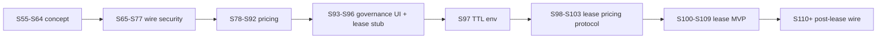

# Galaxy Grid — роадмеп розробки (PoolAI)

**Оновлено:** 2026-05-28 · **HEAD:** `803ffaba` · **Смуга PH-S100…S109:** 10/10 ✅ · **Канон черги:** [`FUNCTION_MANAGEMENT.md`](../catalog/FUNCTION_MANAGEMENT.md) §5.12

Операційний зріз сесій: [`HANDOFF_NEW_SESSION.md`](./HANDOFF_NEW_SESSION.md) · старт наступної: [`NEXT_SESSION_PROMPT.md`](./NEXT_SESSION_PROMPT.md)

---

## 1. Стан черги §5.12 (2026-05-28)

| Стан | Sprint |
|------|--------|
| **Відкрито** | **4** — PH-S122…S124 (vision PH-S113…S115 ✅; PH-S112–S121 ✅) |
| **Закрито PH-S65…S111** | pricing, governance, protocol, lease wire MVP + renew interval env (PH-S94…S111) |
| **Смуга PH-S100…S109** | **10/10 ✅** (2026-05-28) |
| **Поза чергою** | PH-S35/S16/S02 (LAN BLOCKED) · PH-S36/S01/S15 (Cloud SDK Deferred) |

Research replenish ✅ (2026-05-28): PH-S110…S124 після lease/protocol + vision slice PH-S113…S115.

---

## 2. Що реалізовано (карта можливостей)

### 2.1 Pricing (§4.2) — MVP ✅

| Компонент | Де |
|-----------|-----|
| `GET /api/v1/grid/pricing` | `src/network/api/grid.rs` |
| Oracle L1/L2/L3, metrics | `src/grid/galaxy_pricing_oracle.rs` |
| Admin read-only | `/ui/admin/grid-pricing` |
| E2E | `e2e/tests/grid_pricing.spec.ts` |

Env: `POOLAI_GALAXY_PRICE_*`, `POOLAI_GALAXY_PRICING_FALLBACK_JSON`, `POOLAI_GALAXY_PRICING_FORCE_FALLBACK`, `POOLAI_GALAXY_PRICING_PROVIDERS`.

### 2.2 Governance (§9) — ops MVP ✅

| Компонент | Де |
|-----------|-----|
| `poolai-verify-release` | `src/bin/poolai_verify_release.rs` |
| Protocol compat | `src/grid/protocol_compat.rs`, register-remote |
| Docs hub | `docs/security/SECURITY_HARDENING.md` |
| Admin read-only | `/ui/admin/updates-compat` |

### 2.3 Job lease (§4.3) — wire MVP ✅

| Компонент | Спринт | Де |
|-----------|--------|-----|
| Поля `lease_*` на `JobRecord` | PH-S94 | `src/job/types.rs`, POST/GET jobs |
| PATCH CAS `lease_epoch` | PH-S95 | `PATCH /api/v1/jobs/{id}` → `409 lease_epoch_rejected` |
| Admin колонки | PH-S96 | `/ui/admin/jobs` |
| TTL env | PH-S97 ✅ | `POOLAI_JOB_LEASE_TTL_SECS` → `src/job/lease_config.rs` |
| Acquire | PH-S98 ✅ | scheduler + `POST /jobs/{id}/lease` → `src/job/lease_acquire.rs` |

| Renew | PH-S99 ✅ | `POST /jobs/{id}/lease/renew` |
| `JobStatus::Leased` | PH-S100 ✅ | `allows_transition`, acquire/schedule → `leased` |
| Failover requeue stub | PH-S101 ✅ | expired `leased` → `submitted` → scheduler rebind |
| Live provider HTTP fetch | PH-S102 ✅ | endpoint pull from provider catalog + timeout env |
| `X-PoolAI-Protocol` middleware | PH-S103 ✅ | selected routes negotiation, protocol headers, unsupported reject |
| `JobStatus::Migrating` | PH-S104 ✅ | lifecycle transitions `Leased/Executing ↔ Migrating`; OpenAPI + contract tests |
| Admin lease active/expired badge | PH-S105 ✅ | `/ui/admin/jobs` lease-state badge from `lease_expires_at`; i18n + Playwright smoke updates |
| Worker lease renew client stub | PH-S106 ✅ | `poolai-worker` calls `/api/v1/jobs/{id}/lease/renew` on task payload `job_id+lease_epoch` |

| E2E lease acquire+renew | PH-S107 ✅ | `e2e/tests/jobs_lease.spec.ts` |

| Grid ingest → Leased | PH-S108 ✅ | `schedule_with_grid_peer` + lease on bind; `dispatch.rs` tests |
| §4.3 docs sync | PH-S109 ✅ | `POOLAI_GALAXY_GRID.md` §4.3 table; смуга PH-S100…S109 закрита |

| Grid result lease CAS | PH-S110 ✅ | `GridResultBody.lease_epoch`; `check_grid_result_lease_epoch`; unit tests |

| Renew interval env | PH-S111 ✅ | `POOLAI_JOB_LEASE_RENEW_INTERVAL_SECS` → `JobLeaseConfig` |

| Worker renew ticker loop | PH-S116 ✅ | `LeaseRenewGuard` + interval from `JobLeaseConfig` |
| Grid Job envelope E2E | PH-S112 ✅ | `grid_job_lease.spec.ts` |
| Grid result lease E2E | PH-S117 ✅ | `grid_result_lease.spec.ts` |
| Jobs lease negative E2E | PH-S118 ✅ | `jobs_lease.spec.ts` PH-S118 block; e2e TTL=2s |
| Admin jobs lease polish | PH-S119 ✅ | `#epoch`, owner/epoch tooltips, i18n EN/UK |
| Solana adapter vision | PH-S120 ✅ | manifest Solana cluster; DIGEST §; FM-033 crosslink |
| Worker lease heartbeat docs | PH-S121 ✅ | Galaxy §4.3.1.1; discovery vs job renew; `LeaseRenewGuard` |

**Post-MVP (черга §5.12):** PH-S122 OpenAPI audit; PH-S123–S124 e2e/docs.

**Vision (docs):** PH-S113…S115 ✅ — `docs/vision/` L4/L5 layers, pan/zoom map, folder-colored edges.

---

## 3. Черга §5.12 (4 відкритих)

| # | Sprint | Тема | Джерело |
|---|--------|------|---------|
| 1 | **PH-S122** | OpenAPI jobs/grid lease schemas audit | `openapi.yaml`, gap audit |
| 2 | **PH-S123** | Grid pricing E2E negative fallback | `e2e/grid_pricing` |
| 3 | **PH-S124** | OTel lease span attrs docs | FM-038 |

---

## 4. Локальний CI (канон)

```bash
export PATH="$HOME/.cargo/bin:/ucrt64/bin:/usr/bin:$PATH"
export K8S_OPENAPI_ENABLED_VERSION=1.28
cd /s/rust/poolAI
cargo fmt --all && cargo test-ci
cargo run --bin poolai-openapi-gap-audit   # після API
cd e2e && npm run test:ci                  # після src/ui/
```

---

## 5. Діаграма фаз



---

## 6. Пов’язані документи

| Документ | Роль |
|----------|------|
| [`FUNCTION_MANAGEMENT.md`](../catalog/FUNCTION_MANAGEMENT.md) §5.12 | Таблиця PH-S* |
| [`FUNCTIONALITY_DIGEST_2026-04-06.md`](../catalog/FUNCTIONALITY_DIGEST_2026-04-06.md) | Витяг модулів |
| [`docs/vision/index.html`](../vision/index.html) | Візуальна карта (localhost:8765) |
