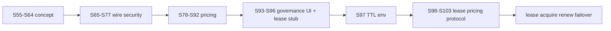

# Galaxy Grid — роадмеп розробки (PoolAI)

**Оновлено:** 2026-05-28 · **HEAD:** PH-S104 (`JobStatus::Migrating` + lifecycle) · **Канон черги:** [`FUNCTION_MANAGEMENT.md`](../catalog/FUNCTION_MANAGEMENT.md) §5.12 · **Концепт:** [`POOLAI_GALAXY_GRID.md`](../concept/POOLAI_GALAXY_GRID.md)

Операційний зріз сесій: [`HANDOFF_NEW_SESSION.md`](./HANDOFF_NEW_SESSION.md) · старт наступної: [`NEXT_SESSION_PROMPT.md`](./NEXT_SESSION_PROMPT.md)

---

## 1. Стан черги §5.12 (2026-05-27)

| Стан | Sprint |
|------|--------|
| **Відкрито** | **PH-S105…S109** (5) — UI, worker renew, e2e, grid docs |
| **Закрито PH-S65…S104** | protocol/register + protocol middleware, verify-release, pricing API/oracle + live provider HTTP fetch, admin UI, lease wire + failover requeue stub + `Migrating` lifecycle |
| **Поза чергою** | PH-S35/S16/S02 (LAN BLOCKED) · PH-S36/S01/S15 (Cloud SDK Deferred) |

Research replenish ✅ (2026-05-27): 6 нових PH-S* у FM §5.12.

---

## 2. Що реалізовано (карта можливостей)

### 2.1 Pricing (§4.2) — MVP ✅

| Компонент | Де |
|-----------|-----|
| `GET /api/v1/grid/pricing` | `src/network/api/grid.rs` |
| Oracle L1/L2/L3, metrics | `src/grid/galaxy_pricing_oracle.rs` |
| Admin read-only | `/ui/admin/grid-pricing` |
| E2E | `e2e/tests/grid_pricing.spec.ts` |

Env: `POOLAI_GALAXY_PRICE_*`, `POOLAI_GALAXY_PRICING_FALLBACK_JSON`, `POOLAI_GALAXY_PRICING_FORCE_FALLBACK`, `POOLAI_GALAXY_PRICING_PROVIDERS`.

### 2.2 Governance (§9) — ops MVP ✅

| Компонент | Де |
|-----------|-----|
| `poolai-verify-release` | `src/bin/poolai_verify_release.rs` |
| Protocol compat | `src/grid/protocol_compat.rs`, register-remote |
| Docs hub | `docs/security/SECURITY_HARDENING.md` |
| Admin read-only | `/ui/admin/updates-compat` |

### 2.3 Job lease (§4.3.1) — wire stub 🟡

| Компонент | Спринт | Де |
|-----------|--------|-----|
| Поля `lease_*` на `JobRecord` | PH-S94 | `src/job/types.rs`, POST/GET jobs |
| PATCH CAS `lease_epoch` | PH-S95 | `PATCH /api/v1/jobs/{id}` → `409 lease_epoch_rejected` |
| Admin колонки | PH-S96 | `/ui/admin/jobs` |
| TTL env | PH-S97 ✅ | `POOLAI_JOB_LEASE_TTL_SECS` → `src/job/lease_config.rs` |
| Acquire | PH-S98 ✅ | scheduler + `POST /jobs/{id}/lease` → `src/job/lease_acquire.rs` |

| Renew | PH-S99 ✅ | `POST /jobs/{id}/lease/renew` |
| `JobStatus::Leased` | PH-S100 ✅ | `allows_transition`, acquire/schedule → `leased` |
| Failover requeue stub | PH-S101 ✅ | expired `leased` → `submitted` → scheduler rebind |
| Live provider HTTP fetch | PH-S102 ✅ | endpoint pull from provider catalog + timeout env |
| `X-PoolAI-Protocol` middleware | PH-S103 ✅ | selected routes negotiation, protocol headers, unsupported reject |
| `JobStatus::Migrating` | PH-S104 ✅ | lifecycle transitions `Leased/Executing ↔ Migrating`; OpenAPI + contract tests |

**Ще не в коді:** lease active/expired UI badge, worker renew client.

---

## 3. Черга §5.12 (5 відкритих)

| # | Sprint | Тема | Джерело |
|---|--------|------|---------|
| 1 | **PH-S105** | Admin lease active/expired badge | §4.3.1 |
| 2 | PH-S106 | Worker lease renew client | §4.3.1 |
| 3 | PH-S107 | E2E lease acquire+renew | e2e |
| 4 | PH-S108 | Grid ingest → Leased | §4.3 |
| 5 | PH-S109 | §4.3 wire docs sync | docs |

---

## 4. Локальний CI (канон)

```bash
export PATH="$HOME/.cargo/bin:/ucrt64/bin:/usr/bin:$PATH"
export K8S_OPENAPI_ENABLED_VERSION=1.28
cd /s/rust/poolAI
cargo fmt --all && cargo test-ci
cargo run --bin poolai-openapi-gap-audit   # після API
cd e2e && npm run test:ci                  # після src/ui/
```

---

## 5. Діаграма фаз



---

## 6. Пов’язані документи

| Документ | Роль |
|----------|------|
| [`FUNCTION_MANAGEMENT.md`](../catalog/FUNCTION_MANAGEMENT.md) §5.12 | Таблиця PH-S* |
| [`FUNCTIONALITY_DIGEST_2026-04-06.md`](../catalog/FUNCTIONALITY_DIGEST_2026-04-06.md) | Витяг модулів |
| [`docs/vision/index.html`](../vision/index.html) | Візуальна карта (localhost:8765) |
