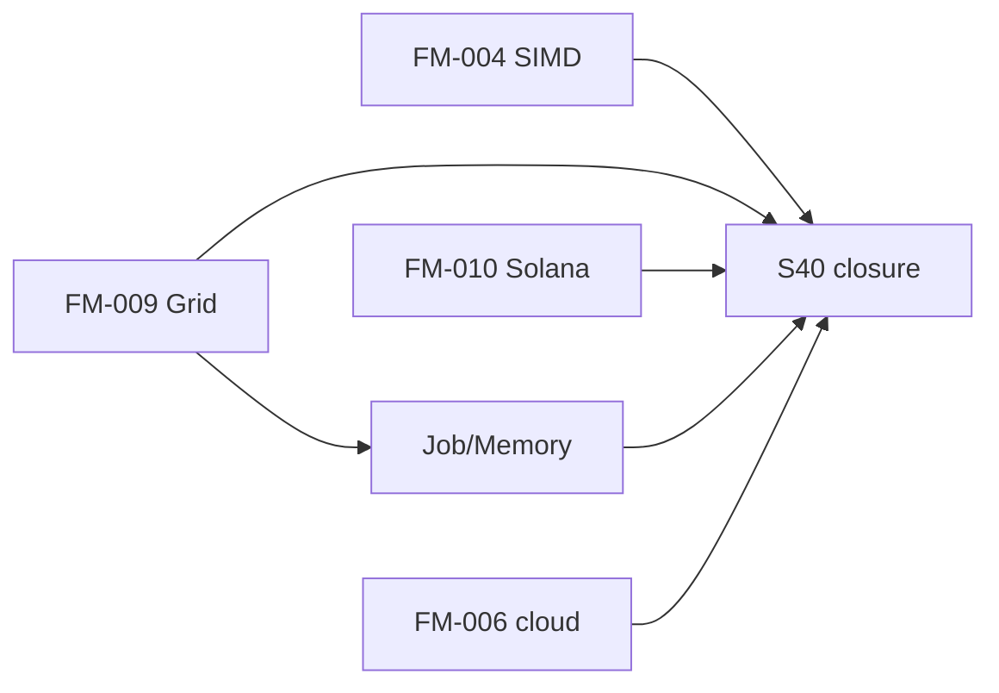

# Horizon → 100% (Layer C + повний проєкт)

**Дата:** 2026-05-19 · **Після:** autoprogon A+B **100%** (S34) · **Канон черги:** [`AUTO_RUN_SESSION_2026_HORIZON.md`](./AUTO_RUN_SESSION_2026_HORIZON.md)

**Мета:** ітеративно довести **Layer C** і **загальну готовність проєкту** до **100%** у межах правил оркестратора — без повторення S21–S34.

---

## Зріз прогресу

| Шар | Зараз | Ціль |
|-----|-------|------|
| **A** (FM-001…019) | **100%** | утримувати |
| **B** (Architect P1–P5) | **100%** | утримувати |
| **C** (Horizon) | **~50%** → **100%** | S35–S37 ✅; S38–S40 |
| **Проєкт (зважено)** | **~83%** | **100%** після S40 |

**Формула проєкту (орієнтир):** `(A + B + C) / 3` → при C=100% і A=B=100% → **100%**.

**Поза кодом (не блокує merge):** FM-003 §4 LAN sign-off — **2 фізичні хости** (runbook only).

---

## Horizon backlog (FM)

| ID | Область | Sпринт | Критерій готовності 100% |
|----|---------|--------|---------------------------|
| **FM-004** | SIMD / TurboQuant fast-path | **S35** | `src/ml/turboquant.rs`: feature `simd` або `turboquant-simd`; bench `turboquant_benchmarks`; тести pack/unpack; docs `TURBOQUANT_INTEGRATION.md` §SIMD |
| **FM-009** | Grid wire envelope | **S36** | `src/grid/` (або `src/protocol/grid_envelope.rs`): `GridEnvelope` v1 JSON; мапінг Job/Result/MemoryShard/PeerStatus → discovery/RAID; тести + розширення `tests/grid_network_scalability_tests.rs` |
| **FM-010** | Solana adapter MVP | **S37** | Crate `crates/poolai-solana-adapter/` або `src/adapters/solana/`: schema подій v1 (`JobCompleted`, `SeedProvided`, `MemoryUpdated`); sidecar stub + README; **без** `solana-sdk` у `poolai` main crate |
| **Job/Memory** | P6 wire types | **S38** | `src/job/` + `src/memory/` (мінімум): типи з [`JOB_LAYER_CONCEPT`](./JOB_LAYER_CONCEPT_2026-03-17.md), [`POOLAI_MEMORY_LAYER.md`](../concept/POOLAI_MEMORY_LAYER.md); unit-тести; OpenAPI optional `/api/v1/jobs` stub |
| **FM-006** | cloud-sdk deep | **S39** | Azure/GCP: закрити `TODO` у `azure.rs`/`gcp.rs` або задокументувати scope + mock tests; `CLOUD_SDK_STATUS.md` |
| **C closure** | Layer C 100% | **S40** | `DEVELOPMENT_PROGRESS` C=100%; FM §5.6; DIGEST §Horizon; CHANGELOG; `NEXT_SESSION` → maintenance |

---

## Концепт-доки (читати перед кодом)

| FM | Документ |
|----|----------|
| FM-009 | [`GRID_PROTOCOL_CONCEPT_2026-04-06.md`](./GRID_PROTOCOL_CONCEPT_2026-04-06.md), [`concept/POOLAI_GRID_NODE.md`](../concept/POOLAI_GRID_NODE.md) |
| FM-010 | [`SOLANA_ADAPTER_CONCEPT_2026-04-06.md`](./SOLANA_ADAPTER_CONCEPT_2026-04-06.md) |
| FM-004 | [`ml/TURBOQUANT_INTEGRATION.md`](../ml/TURBOQUANT_INTEGRATION.md), Architect P2b |
| Job/Memory | [`JOB_LAYER_CONCEPT_2026-03-17.md`](./JOB_LAYER_CONCEPT_2026-03-17.md), [`concept/POOLAI_MEMORY_LAYER.md`](../concept/POOLAI_MEMORY_LAYER.md) |

---

## Правила автопрогону (horizon)

1. **S0:** `git fetch`; HANDOFF; FM §5.1 + **§5.6**; цей файл; [`AUTO_RUN_SESSION_2026_HORIZON.md`](./AUTO_RUN_SESSION_2026_HORIZON.md).
2. **Один спринт за ітерацію** (S35 → S36 → …) — commit + push після `cargo test-ci`.
3. **Не делегувати:** git push, FM §5.6, фінальний Summary.
4. **Після коду:** `cargo fmt` → `cargo test-ci` (`K8S_OPENAPI_ENABLED_VERSION=1.28`).
5. **Не стаджити:** `data/audit/*.log.gz`, `data/dev/`, `data/lan-stand/`.
6. **FM-003 §4:** не стартувати без 2 хостів.

---

## Залежності спринтів

**Паралельно можливі:** S35 + S36 (різні модулі); Solana (S37) — окремий crate.

---

## Перевірка Layer C = 100%

- [ ] FM-004, FM-009, FM-010 — **Implemented** у таблиці FM-* (не Concept-only)
- [ ] Job/Memory — мінімальні типи в `src/` + тести
- [ ] FM-006 — Partial або Implemented за scope S39
- [ ] `DEVELOPMENT_PROGRESS` — Layer C **100%**, проєкт **100%**
- [ ] Немає суперечностей 93% у STABLE_STATE / Architect §операційний порядок

---

**Last updated:** 2026-05-19 (підготовка до S35).
