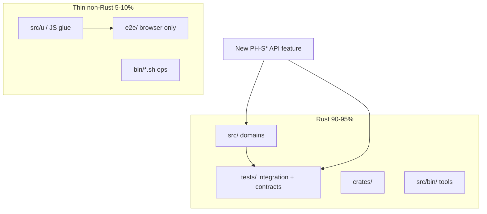

# Rust codebase ratio — стратегія 90–95% (PoolAI)

**Оновлено:** 2026-07-19 · band 50 **PH-S1139…S1148** ✅ · rust_ratio **≥95%** formal · stretch **96%** advisory

**Мета:** зростання частки **Rust** у виконуваному коді репозиторію до **90–95%** (формально), **96% stretch spirit** (орієнтир replenish PH-S150…S159) — платформа збирається і перевіряється через **`cargo`** без обов'язкового Node на edge.

---

## 1. Ціль і вимір

| Показник | Ціль | Коментар |
|----------|------|----------|
| **Rust LOC share** | **90–95%** (formal) · **96% stretch** | `src/`, `tests/`, `crates/`, `src/bin/` |
| **Non-Rust (допустимо)** | **5–10%** | `src/ui/*.js` (glue), `e2e/*.ts` (лише browser), `bin/*.sh` (ops) |
| **Поза ratio** | docs, `.md`, CI yaml, snapshots PNG | не входять у знаменник «коду продукту» |

**Орієнтовний зріз (2026-06-20, PH-S715):** **`94.76%`** Rust LOC (`cargo run --bin poolai-loc-audit` → [`rust_ratio.json`](./rust_ratio.json)). Formal **≥95%** gate — completion bands **28–29** (PH-S930…S949). Non-Rust «шум»: **`i18n_core.js`**, **`admin_common.js`**, **`admin_charts.js`**, browser-only `e2e/tests/`, ops shell.

**Audit:** `cargo run --bin poolai-loc-audit` — звіт `docs/development/rust_ratio.json` для FM §5.13 / PH-S151…S170 gates. CI hold advisory (PH-S165): `cargo run --bin poolai-loc-audit -- --warn-below 0.93 --target 0.95 --stretch 0.96 --min-ratio 0.95 --advisory`. Band 46 (PH-S1100): `cargo run --bin poolai-loc-audit -- --migration-advisory` — ui_js + archived e2e migration registry у `rust_migration_advisory_depth.rs`. Band 47 (PH-S1110): `cargo run --bin poolai-loc-audit -- --stable-touchup` — STABLE maintenance criteria registry у `stable_state_touchup_depth.rs`. Band 48 (PH-S1120): `cargo run --bin poolai-loc-audit -- --edge-verification-advisory` — Galaxy §6.6 edge verification criteria registry у `galaxy_edge_verification_depth.rs`. Band 49 (PH-S1130): `cargo run --bin poolai-loc-audit -- --pre-push-canon` — git pre-push canon gate criteria registry у `pre_push_hook_depth.rs`. Band 50 (PH-S1140): `cargo run --bin poolai-loc-audit -- --ci-canon` — local CI dual-gate criteria registry у `ci_canon_depth.rs`.

---

## 2. Портативність «працює де завгодно»

| Шар | Технологія | Пристрої |
|-----|------------|----------|
| **Coordinator / worker / tools** | Rust binaries | Linux, Windows, macOS; ARM/x86; без JVM/Python |
| **HTTP API + business rules** | Rust `src/` | будь-який клієнт (curl, mobile, bot) |
| **Admin UI (поточний)** | HTML + thin JS | будь-який браузер; Node **не** на production host |
| **Admin UI (wasm POC PH-S147 ✅)** | **`crates/poolai-ui-wasm`** → `src/ui/wasm/` via `bash bin/build-ui-wasm.sh` | grid-pricing + lease helpers; shared logic з `poolai-ui-core` |
| **Admin UI (горизонт)** | повне підключення wasm у admin panels | post-POC; thin JS лишається DOM glue |
| **Перевірка якості** | **`cargo test-ci`** | dev/CI на будь-якій машині з Rust toolchain |
| **Browser regression** | Playwright (мінімум) | лише CI/dev з Node; не на edge nodes |

**Принцип:** нові можливості — **Rust-first**; JS/TS — лише те, що браузер не отримує з WASM/DOM glue; Node — лише harness для axe/visual/admin smoke.

**Portable deploy (PH-S149 sync, коротко):**

| Surface | Coordinator / worker | Admin UI | Перевірка без Node |
|---------|----------------------|----------|-------------------|
| Linux / Windows dev | `cargo build --release` | HTML + JS; wasm via `bash bin/build-ui-wasm.sh` | `cargo test-ci`, `poolai-http-stand-smoke` |
| Edge node | Rust binary only | static UI (optional wasm) | curl / Rust smoke bins |

---

## 3. Піраміда розробки (узгоджено з testing policy)

| Тип задачі | Куди писати | Не робити |
|------------|-------------|-----------|
| API, grid, job, discovery, telegram wire | `src/` + `tests/*_integration.rs` | новий `e2e/tests/*.spec.ts` для HTTP-only |
| Валідація, pricing, trust, locality | `src/grid/`, unit + integration | дубль логіки в JS |
| Admin read-only panel | `src/ui/admin/*.rs` HTML + мінімум JS | великі JS modules |
| DOM / a11y / theme / visual | `e2e/tests/smoke|admin|a11y|visual` | — |
| Shared UI↔server rules | `crates/poolai-ui-core` (PH-S146) → wasm (PH-S147) | copy-paste у TS |

---

## 4. Фази (роадмеп)

| Фаза | Коли | Дія | Ratio |
|------|------|-----|-------|
| **A — freeze** | зараз (PH-S140…S142) | нові API acceptance → Rust tests; UI спринти — thin JS | утримати ≥88% |
| **B — dedupe** | §5.13 PH-S144…S145 | перенести legacy API Playwright → Rust; HTTP stand smoke bin | +3–5% |
| **C — UI core** | PH-S146…S147 | shared Rust crate + wasm32 POC для admin helpers | +2–4% |
| **D — slim e2e** | PH-S148 | `e2e/` лише smoke/admin/a11y/visual; прибрати API specs з `test:ci` | +1–2% |
| **E — gate** | PH-S150 ✅ | CI advisory якщо ratio <88%; target 93%; stretch 96% spirit | стабільно 90–95% |
| **F — stretch 96%** | PH-S151…S159 ✅ | wasm wiring, slim JS/i18n/charts, Rust stand/e2e bins; CI warn **93%** | **→96% spirit** |

**Черга §5.12:** **10** active PH-S690…S699 (band 4) · **321** master backlog PH-S690…S1010 ([§5.14](../catalog/FUNCTION_MANAGEMENT.md#514-master-backlog-ph-s660s1010-351-pending-2026-06-20)). **Band slots 1–2 theme-aware** — [`generate-ph-s-master-backlog-351.sh`](../../scripts/generate-ph-s-master-backlog-351.sh).

---

## 5. FM §5.13 — черга PH-S143…S159

| # | Sprint | Фокус | Acceptance |
|---|--------|--------|------------|
| 1 | **PH-S143** | LOC ratio baseline audit | `cargo run --bin poolai-loc-audit`; [`rust_ratio.json`](./rust_ratio.json) **91.48%**; FM оновлено | **✅** |
| 2 | **PH-S144** | Playwright API → Rust migration | `jobs_lease`, `grid_*`, `protocol_middleware`, `telegram_wallet`, `jobs_migrating` покриті integration; Playwright specs archived або deleted | **✅** |
| 3 | **PH-S145** | `poolai-http-stand-smoke` bin (Rust) | `reqwest` + stand env; RUN_LOCAL doc; `--raid` + `POOLAI_E2E_STAND_ROOT` | **✅** |
| 4 | **PH-S146** | `crates/poolai-ui-core` stub | shared validators/formatters з admin JS винесені в Rust crate + unit tests | **✅** |
| 5 | **PH-S147** | wasm32 admin core POC | один panel helper compiled to wasm; docs portability §2 | **✅** |
| 6 | **PH-S148** | Slim `e2e/` | `test:ci` без API patterns; ratio ≥90% | **✅** |
| 7 | **PH-S150** | Ratio CI advisory | CI `rust-ratio-audit`; `--warn-below 0.88` `--target 0.93` `--stretch 0.96` `--advisory`; **92.00%** | **✅** |
| 8 | **PH-S151** | wasm grid-pricing wiring | `/ui/wasm/*` + grid-pricing module; Playwright smoke | **✅** |
| 9 | **PH-S152** | wasm jobs lease display | shared `POOLAI_UI_WASM_MODULE`; jobs `leaseStateLabel`; Playwright smoke | **✅** |
| 10 | **PH-S153** | admin_common slim | `table.rs` + wasm; admin_common −426 LOC | **✅** |
| 11 | **PH-S154** | Admin i18n subset Rust | slim `i18n_core.js` admin keys | **✅** |
| 12 | **PH-S155** | ML charts → wasm | admin_charts canvas-only glue | **✅** |
| 13 | **PH-S156** | jobs_raid → Rust smoke | drop `jobs_raid` from `test:ci` | **✅** |
| 14 | **PH-S157** | topology SVG Rust | slim `topology_graph.js` | **✅** |
| 15 | **PH-S158** | `poolai-e2e-stand` bin | Rust stand lifecycle; slim shell | **✅** |
| 16 | **PH-S159** | Ratio **96%** stretch gate | warn 93%; stretch 96%; replenish post-S159 | **✅** |
| 17 | **PH-S160** | Admin theme → Rust | slim `admin_theme.js` | **✅** |
| 18 | **PH-S161** | Admin modal a11y → wasm | slim `admin_modal_a11y.js` | **✅** |
| 19 | **PH-S162** | Auth i18n subset Rust | slim `i18n_core.js` auth block | ✅ |
| 20 | **PH-S163** | Galaxy trust metrics wire | Prometheus on grid result path | ✅ |
| 21 | **PH-S164** | Verify sampling env apply | `galaxy_verify_sampling` HTTP stub | ✅ |
| 22 | **PH-S165** | Ratio **96%** hold gate | CI `--min-ratio 0.95` advisory; target **95%**; replenish post-S165 | **✅** |
| 23 | **PH-S166** | Design tokens CSS → Rust | `design_tokens.rs`; slim CSS `:root` | **✅** |
| 24 | **PH-S167** | Galaxy prefetch metrics stub | Prometheus on `plan_prefetch` | **✅** |
| 25 | **PH-S168** | Galaxy pricing cache age /metrics | `galaxy_pricing_cache_age_seconds` gauge | **✅** |
| 26 | **PH-S169** | Locality stale profile penalty | `stale_network_profile_penalty` stub | **✅** |
| 27 | **PH-S170** | Galaxy settlement pending_verification stub | `SettlementStatus` on grid result | **✅** |
| 28 | **PH-S171** | Galaxy replication strict tier stub | §6.3 `replication_strict` config | **✅** |
| 29 | **PH-S172** | Galaxy pricing provider catalog metrics stub | §4.2 catalog hits | **✅** |
| 30 | **PH-S173** | Galaxy pricing provider errors metrics stub | §4.2 provider fetch fail | **✅** |
| 31 | **PH-S174** | Galaxy pricing quote usd_micro metrics stub | §4.2 last quote gauge | **✅** |
| 32 | **PH-S175** | Galaxy verification mismatch metrics stub | §6.2 mismatch counter | **✅** |
| 33 | **PH-S176** | Galaxy replay pending metrics stub | §6.3 replay pending gauge | **✅** |
| 34 | **PH-S177** | Galaxy verification sample total metrics stub | §6.2 sample counter | **✅** |
| 35 | **PH-S178** | Galaxy settlement pending_verification metrics stub | §6.4 grid result path | **✅** |
| 36 | **PH-S179** | Galaxy replication strict tier metrics stub | §6.3 grid job ingest | **✅** |
| 37 | **PH-S180** | Galaxy verification match metrics stub | §6.2 match counter | **✅** |
| 38 | **PH-S181** | Galaxy pricing market min usd_micro metrics stub | §4.2 market min gauge | **✅** |
| 39 | **PH-S182** | Galaxy trust score metrics stub | §6.2 trust score gauge | **✅** |
| 40 | **PH-S183** | Galaxy shard local hit ratio metrics stub | §5.3 locality gauge | **✅** |
| 41 | **PH-S184** | Galaxy prefetch bytes total metrics stub | §5.5 prefetch path | **✅** |
| 42 | **PH-S185** | Galaxy cross region egress mb metrics stub | §5.3 rank/prefetch | **✅** |
| 43 | **PH-S186** | Galaxy verification sample scheduled /metrics export | §6.2 PH-S164 export | **✅** |
| 44 | **PH-S187** | Galaxy settlement cleared total metrics stub | §6.4 Cleared path | **✅** |
| 45 | **PH-S188** | Vision map filters UX | docs/vision filters | **✅** |
| 46 | **PH-S189** | Vision Eco/FX/Ms hover trace | docs/vision Ms mode | **✅** |
| 47 | **PH-S190** | Vision filter dropdowns + panel collapse | docs/vision layout | **✅** |
| 48 | **PH-S191** | Vision sprint queue panel | FM §5.12 parse | **✅** |
| 49 | **PH-S192** | Vision overview LOD + minimap | docs/vision minimap | **✅** |
| 50 | **PH-S193** | Dashboard shell formatters → wasm | poolai-ui-core | **✅** |
| 51 | **PH-S194** | Galaxy fee split result counter | §4.1 stub | **✅** |
| 52 | **PH-S195** | Galaxy seed_inventory GET | §5.5 wire | **✅** |
| 53 | **PH-S196** | Stand smoke lease renew | poolai-http-stand-smoke | **✅** |
| 54 | **PH-S197** | updates-compat wasm | admin UI | **✅** |
| 55 | **PH-S198** | Topology Rust labels slim | PH-S157 | **✅** |
| 56 | **PH-S199** | Vision map Ms hit-test + focus nav | docs/vision | **✅** |
| 57 | **PH-S200** | Vision feed.json RSS | docs/vision | **✅** (PH-S269) |
| 58 | **PH-S201** | Cursor post-push hook | VDT ops | **✅** (pre-push fmt) |
| 59 | **PH-S202** | Vision sprint-queue → map focus | docs/vision | **✅** (PH-S226) |
| 60 | **PH-S203** | Vision keyboard nav nodes | docs/vision | **✅** (PH-S199) |
| 61 | **PH-S204** | Vision edge click select | docs/vision | **✅** (PH-S199) |
| 62 | **PH-S205** | poolai-vision-sync drift gate | ops | **✅** (PH-S270/S280) |
| 63 | **PH-S206** | Vision minimap selection ring | docs/vision | **✅** (PH-S192) |
| 64 | **PH-S207** | Admin i18n slim next panel | code | **✅** (PH-S211…S266 band) |
| 65 | **PH-S208** | Stand smoke vision rev parity | tests | **✅** (PH-S235) |
| 66 | **PH-S209** | Vision map a11y focus ring | docs/vision | **✅** |
| 67 | **PH-S210** | Stand smoke seed_inventory GET | tests | **✅** |
| 68 | **PH-S211** | Admin i18n slim jobs panel | code | **✅** |
| 69 | **PH-S212** | Vision reduced-motion map FX | docs/vision | **✅** |
| 70 | **PH-S213** | Galaxy prefetch metrics stand smoke | tests | **✅** |
| 71 | **PH-S214** | Admin i18n slim raid panel | code | **✅** |
| 72 | **PH-S215** | Vision panel collapse focus restore | docs/vision | **✅** |
| 73 | **PH-S216** | Galaxy pricing fallback metrics smoke | tests | **✅** |
| 74 | **PH-S217** | Admin i18n slim grid-pricing panel | code | **✅** |
| 75 | **PH-S218** | Vision map aria-live selection | docs/vision | **✅** |
| 76 | **PH-S219** | Galaxy trust payout metrics smoke | tests | **✅** |
| 77 | **PH-S220** | Admin i18n slim monitoring panel | code | **✅** |
| 78 | **PH-S221** | Admin i18n slim updates-compat panel | code | **✅** |
| 79 | **PH-S222** | Admin i18n slim workers panel | code | **✅** |
| 80 | **PH-S223** | Admin i18n slim libs panel | code | **✅** |
| 81 | **PH-S224** | Galaxy pricing cache age metrics smoke | tests | **✅** |
| 82 | **PH-S225** | Galaxy verification sample metrics smoke | tests | **✅** |
| 83 | **PH-S226** | Vision sprint-queue → map focus | docs/vision | **✅** |
| 84 | **PH-S227** | Vision VDT rules docs autosync audit | docs/vision | **✅** |
| 85 | **PH-S228** | Admin i18n slim dashboard panel | code | **✅** |
| 86 | **PH-S229** | Admin i18n slim audit panel | code | **✅** |
| 87 | **PH-S230** | Admin i18n slim tenants panel | code | **✅** |
| 88 | **PH-S231** | Admin i18n slim security panel | code | **✅** |
| 89 | **PH-S232** | Galaxy replication metrics stand smoke | tests | **✅** |
| 90 | **PH-S233** | Vision map sprint chips a11y | docs/vision | **✅** |
| 91 | **PH-S234** | Admin i18n slim topology panel | code | **✅** |
| 92 | **PH-S235** | Stand smoke vision rev parity | tests | **✅** |
| 93 | **PH-S236** | Admin i18n slim instances panel | code | **✅** |
| 94 | **PH-S237** | Admin i18n slim vm panel | code | **✅** |
| 95 | **PH-S238** | Admin i18n slim users panel | code | **✅** |
| 96 | **PH-S239** | Admin i18n slim config panel | code | **✅** |
| 97 | **PH-S240** | Admin i18n slim table toolbar | code | **✅** |
| 98 | **PH-S241** | Galaxy pricing fresh served metrics stand smoke | tests | **✅** |
| 99 | **PH-S242** | Admin i18n nav shell key audit | code | **✅** |
| 100 | **PH-S243** | Admin i18n slim admin chrome shell | code | **✅** |
| 101 | **PH-S244** | Galaxy pricing stale served metrics stand smoke | tests | **✅** |
| 102 | **PH-S245** | Admin shared status keys slim patch | code | **✅** |
| 103 | **PH-S246** | Admin err hint keys slim patch | code | **✅** |
| 104 | **PH-S247** | Galaxy pricing provider metrics stand smoke | tests | **✅** |
| 105 | **PH-S248** | Admin vm modal i18n slim | code | **✅** |
| 106 | **PH-S249** | Galaxy settlement metrics stand smoke | tests | **✅** |
| 107 | **PH-S250** | Galaxy shard locality metrics stand smoke | tests | **✅** |
| 108 | **PH-S251** | Docs roadmap sync band | docs | **✅** |
| 109 | **PH-S252** | Admin shared ui.confirm slim patch | code | **✅** |
| 110 | **PH-S253** | Galaxy pricing quote + market_min stand smoke | tests | **✅** |
| 111 | **PH-S254** | Galaxy fee_split_applied stand smoke | tests | **✅** |
| 112 | **PH-S255** | Galaxy cross_region_egress stand smoke | tests | **✅** |
| 113 | **PH-S256** | Galaxy replay_pending stand smoke | tests | **✅** |
| 114 | **PH-S257** | Admin i18n workers panel slim patch | code | **✅** |
| 115 | **PH-S258** | Admin i18n home shell slim patch | code | **✅** |
| 116 | **PH-S259** | Admin i18n form + err core slim patch | code | **✅** |
| 117 | **PH-S260** | Admin i18n shared ui toolbar slim patch | code | **✅** |
| 118 | **PH-S261** | Docs canon sync band | docs | **✅** |
| 119 | **PH-S262** | Rust ratio loc-audit refresh + hold gate | ops | **✅** |
| 120 | **PH-S263** | Admin i18n residual ui.* + common.* slim patch | `admin_ui_common_patch`; keys out of `i18n_core.js` | **✅** |
| 121 | **PH-S264** | Dashboard libs panel i18n slim | `libs.*` → poolai-ui-core | **✅** |
| 122 | **PH-S265** | Dashboard raid panel i18n slim | `raid.*` → poolai-ui-core | **✅** |
| 123 | **PH-S266** | i18n_core.js near-empty gate + loc-audit | STRINGS core **0** keys | **✅** |
| 124 | **PH-S267** | Docs canon sync band | INDEX/HANDOFF/NEXT | **✅** |
| 125 | **PH-S268** | Galaxy prefetch horizon doc | GALAXY §5.5 | **✅** |
| 126 | **PH-S269** | Vision feed.json refresh | docs/vision | **✅** |
| 127 | **PH-S270** | poolai-vision-sync drift gate | ops | **✅** |
| 128 | **PH-S271** | Rust ratio hold advisory refresh | **94.34%** advisory | **✅** |
| 129 | **PH-S272** | Docs INDEX sprint zriz | INDEX §7 ratio | **✅** |
| 130 | **PH-S273** | admin_common api-error path slim | wasm-first; drop `hintFor503` JS dup | **✅** |
| 131 | **PH-S274** | admin_common loading/error DOM wasm glue | `adminShowLoading` / inline error | **✅** |
| 132 | **PH-S275** | admin_charts sparkline wasm-only glue | slim canvas path | **✅** |
| 133 | **PH-S276** | Galaxy prefetch ingest stub | `ingest_job_prefetch_stub` | **✅** |
| 134 | **PH-S277** | topology_graph.js paint-only audit | JS ≤100 LOC gate | **✅** |
| 135 | **PH-S278** | Rust ratio loc-audit refresh | **94.36%** sprint zriz | **✅** |
| 136 | **PH-S279** | Docs canon sync band | INDEX/HANDOFF/NEXT | **✅** |
| 137 | **PH-S280** | poolai-vision-sync drift gate | `--check` green | **✅** |
| 138 | **PH-S281** | Ratio hold advisory snapshot | **94.36%** advisory | **✅** |
| 139 | **PH-S282** | Docs INDEX ratio maintain | INDEX §7 pointer | **✅** |
| 140 | **PH-S283** | Galaxy prefetch enqueue wire stub | `enqueue_prefetch_hook` | **✅** |
| 141 | **PH-S284** | admin line chart wasm HTML | slim `poolaiRenderLineChart` | **✅** |
| 142 | **PH-S285** | Galaxy locality rank ingest stub | job `required_shard_ids` | **✅** |
| 143 | **PH-S286** | Stand smoke prefetch enqueue | `galaxy_prefetch_enqueue_total` | **✅** |
| 144 | **PH-S287** | admin_charts metric group wasm | `poolaiGroupMetricsByName` | **✅** |
| 145 | **PH-S288** | Rust ratio loc-audit refresh | **94.36%** sprint zriz | **✅** |
| 146 | **PH-S289** | Docs canon sync band | INDEX/HANDOFF/NEXT | **✅** |
| 147 | **PH-S290** | poolai-vision-sync drift gate | `--check` green | **✅** |
| 148 | **PH-S291** | Ratio hold advisory snapshot | **94.36%** advisory | **✅** |
| 149 | **PH-S292** | Docs INDEX ratio maintain | INDEX §7 pointer | **✅** |
| 150 | **PH-S293** | Galaxy prefetch wait hook stub | `galaxy_prefetch_wait_ms_total` | **✅** |
| 151 | **PH-S294** | admin metrics chart grid wasm | `renderMetricsChartGridHtml` | **✅** |
| 152 | **PH-S295** | Galaxy locality rank ingest metric | `galaxy_locality_rank_ingest_total` | **✅** |
| 153 | **PH-S296** | Stand smoke prefetch wait + locality | `/metrics` export shape | **✅** |
| 154 | **PH-S297** | admin_charts sanitizeChartId wasm | `sanitizeChartId` wasm-first | **✅** |
| 155 | **PH-S298** | Rust ratio loc-audit refresh | **94.37%** sprint zriz | **✅** |
| 156 | **PH-S299** | Docs canon sync band | INDEX/HANDOFF/NEXT | **✅** |
| 157 | **PH-S300** | poolai-vision-sync drift gate | `--check` green | **✅** |
| 158 | **PH-S301** | Ratio hold advisory snapshot | **94.37%** advisory | **✅** |
| 159 | **PH-S302** | Docs INDEX ratio maintain | INDEX §7 pointer | **✅** |
| 160 | **PH-S303** | Galaxy prefetch strict mode metric | `galaxy_prefetch_strict_mode_total` | **✅** |
| 161 | **PH-S304** | admin line chart empty wasm | `renderLineChartEmptyHtml` | **✅** |
| 162 | **PH-S305** | Galaxy locality rank miss metric | `galaxy_locality_rank_miss_total` | **✅** |
| 163 | **PH-S306** | Stand smoke strict + rank miss | `/metrics` export shape | **✅** |
| 164 | **PH-S307** | Galaxy complete prefetch hook | `complete_prefetch_hook` | **✅** |
| 165 | **PH-S308** | Rust ratio loc-audit refresh | **94.38%** sprint zriz | **✅** |
| 166 | **PH-S309** | Docs canon sync band | INDEX/HANDOFF/NEXT | **✅** |
| 167 | **PH-S310** | poolai-vision-sync drift gate | `--check` green | **✅** |
| 168 | **PH-S311** | Ratio hold advisory snapshot | **94.38%** advisory | **✅** |
| 169 | **PH-S312** | Docs INDEX ratio maintain | INDEX §7 pointer | **✅** |
| 170 | **PH-S313** | Galaxy prefetch ingest metric | `galaxy_prefetch_ingest_total` | **✅** |
| 171 | **PH-S314** | admin metric history URL wasm | `buildMetricHistoryUrl` | **✅** |
| 172 | **PH-S315** | Galaxy locality empty workers | `galaxy_locality_rank_empty_workers_total` | **✅** |
| 173 | **PH-S316** | Stand smoke ingest + empty workers | `/metrics` export | **✅** |
| 174 | **PH-S317** | admin metrics window URL wasm | `buildMetricsWindowUrl` | **✅** |
| 175 | **PH-S318** | Rust ratio loc-audit refresh | **94.39%** sprint zriz | **✅** |
| 176 | **PH-S319** | Docs canon sync band | INDEX/HANDOFF/NEXT | **✅** |
| 177 | **PH-S320** | poolai-vision-sync drift gate | `--check` green | **✅** |
| 178 | **PH-S321** | Ratio hold advisory snapshot | **94.39%** advisory | **✅** |
| 179 | **PH-S322** | Docs INDEX ratio maintain | INDEX §7 pointer | **✅** |
| 180 | **PH-S323** | Galaxy prefetch skip ingest metric | `galaxy_prefetch_skip_ingest_total` | **✅** |
| 181 | **PH-S324** | admin ML pipelines URL wasm | `buildMlPipelinesUrl` | **✅** |
| 182 | **PH-S325** | Galaxy locality rank skip metric | `galaxy_locality_rank_skip_total` | **✅** |
| 183 | **PH-S326** | Stand smoke skip metrics | `/metrics` export | **✅** |
| 184 | **PH-S327** | admin ML demo URL wasm | `buildMlPipelineDemoUrl` | **✅** |
| 185 | **PH-S328** | Rust ratio loc-audit refresh | **94.37%** sprint zriz | **✅** |
| 186 | **PH-S329** | Docs canon sync band | INDEX/HANDOFF/NEXT | **✅** |
| 187 | **PH-S330** | poolai-vision-sync drift gate | `--check` green | **✅** |
| 188 | **PH-S331** | Ratio hold advisory snapshot | **94.37%** advisory | **✅** |
| 189 | **PH-S332** | Docs INDEX ratio maintain | INDEX §7 pointer | **✅** |
| 190 | **PH-S920** | admin_charts sparkline wasm-only | `render_sparkline_html`; no JS SVG fallback | **✅** |
| 191 | **PH-S921** | admin_charts line chart wasm-only | `render_line_chart_html`; no `escapeHtml` fallback | **✅** |
| 192 | **PH-S922** | admin_charts regression tests | mod.rs PH-S920/S921 wasm-only gates | **✅** |
| 193 | **PH-S923** | build-ui-wasm.sh gate | bin verify in mod.rs | **✅** |
| 194 | **PH-S924** | charts depth stub | `charts_depth_stub` unit test | **✅** |
| 195 | **PH-S925** | Rust ratio loc-audit refresh | **94.80%** sprint zriz | **✅** |
| 196 | **PH-S926** | RUST_RATIO §5.13 charts band 27 row | docs canon | **✅** |
| 197 | **PH-S927** | poolai-vision-sync drift gate | `--check` green | **✅** |
| 198 | **PH-S928** | Ratio hold advisory snapshot | **94.80%** advisory | **✅** |
| 199 | **PH-S929** | galaxy_horizon_s920_integration | charts wasm band close | **✅** |
| 200 | **PH-S930** | admin_common table init wasm-only | `admin_common_depth_stub`; slim toolbar/export/sort glue | **✅** |
| 201 | **PH-S931** | admin_common empty state wasm-only | `emptyStateHtml` / `renderTableHtml` wasm-only | **✅** |
| 202 | **PH-S932** | i18n_core mergeRustI18nPatch | no duplicate `poolaiT` in admin_common | **✅** |
| 203 | **PH-S933** | ratio 95% formal gate test | `ratio_95_formal_gate_met` in loc-audit | **✅** |
| 204 | **PH-S934** | ui_js loc reduction metric | `ui_js_loc_reduction` vs band-28 baseline | **✅** |
| 205 | **PH-S935** | Rust ratio loc-audit refresh | **94.88%** sprint zriz | **✅** |
| 206 | **PH-S936** | RUST_RATIO §5.13 band 28 row | docs canon | **✅** |
| 207 | **PH-S937** | poolai-vision-sync drift gate | `--check` green | **✅** |
| 208 | **PH-S938** | Ratio hold advisory snapshot | **94.88%** advisory | **✅** |
| 209 | **PH-S939** | galaxy_horizon_s930_integration | admin_common ratio 95% band close | **✅** |
| 210 | **PH-S940** | e2e scope audit — API-only removed | `tests/e2e_scope_audit.rs`; browser-only `test:ci` | **✅** |
| 211 | **PH-S941** | e2e TS loc reduction | `jobs_raid` archived; `e2e_ts_loc_reduction` metric | **✅** |
| 212 | **PH-S942** | ratio 96% stretch spirit gate | `stretch_spirit_gate_met` in loc-audit | **✅** |
| 213 | **PH-S943** | ops shell audit — no product logic | `ops_shell_canon_met`; no `.rs` in `bin/`/`scripts/` | **✅** |
| 214 | **PH-S944** | stretch depth stub | `stretch_depth_stub` unit test | **✅** |
| 215 | **PH-S945** | Rust ratio loc-audit refresh | **94.91%** sprint zriz | **✅** |
| 216 | **PH-S946** | RUST_RATIO §5.13 band 29 row | docs canon | **✅** |
| 217 | **PH-S947** | poolai-vision-sync drift gate | `--check` green | **✅** |
| 218 | **PH-S948** | Ratio stretch advisory snapshot | **94.91%** stretch note | **✅** |
| 219 | **PH-S949** | galaxy_horizon_s940_integration | e2e stretch band close | **✅** |
| 220 | **PH-S950** | FUNCTIONALITY_DIGEST grid section sync | all src/grid modules listed | **✅** |
| 221 | **PH-S951** | FUNCTIONALITY_DIGEST job/lease sync | src/job rows | **✅** |
| 222 | **PH-S952** | FUNCTIONALITY_DIGEST ui/wasm sync | crates rows | **✅** |
| 223 | **PH-S953** | FUNCTIONALITY_DIGEST bins table | src/bin/ all listed | **✅** |
| 224 | **PH-S954** | DIGEST OpenAPI pointer refresh | gap audit note | **✅** |
| 225 | **PH-S955** | Rust ratio loc-audit refresh | **94.91%** sprint zriz | **✅** |
| 226 | **PH-S956** | file_list.csv catalog sync | key paths | **✅** |
| 227 | **PH-S957** | poolai-vision-sync drift gate | `--check` green | **✅** |
| 228 | **PH-S958** | Ratio hold advisory snapshot | **94.91%** digest band hold | **✅** |
| 229 | **PH-S959** | galaxy_horizon_s950_integration | digest band close | **✅** |
| 230 | **PH-S960** | DOCS_LEGACY_AUDIT remaining rows triage | table update | **✅** |
| 231 | **PH-S961** | stale banners on flat docs/*.md | pointer to INDEX/archive | **✅** |
| 232 | **PH-S962** | concept root de-hype pass | poolAI_concept_root.txt zriz | **✅** |
| 233 | **PH-S963** | ARCHITECT vs FM §5.1 alignment | NEXT_STEPS_ARCHITECT sync | **✅** |
| 234 | **PH-S964** | docs archive pointer batch | DOCS_LEGACY §5.3 | **✅** |
| 235 | **PH-S965** | Rust ratio loc-audit refresh | **94.91%** sprint zriz | **✅** |
| 236 | **PH-S966** | INDEX step 12 FM pointer | docs | **✅** |
| 237 | **PH-S967** | poolai-vision-sync drift gate | `--check` green | **✅** |
| 238 | **PH-S968** | Ratio hold advisory snapshot | **94.91%** docs legacy hold | **✅** |
| 239 | **PH-S969** | galaxy_horizon_s960_integration | DOCS_LEGACY close | **✅** |
| 240 | **PH-S970** | Galaxy §1–3 implemented markers | POOLAI_GALAXY_GRID.md | **✅** |
| 241 | **PH-S971** | Galaxy §4–6 implemented markers | same | **✅** |
| 242 | **PH-S972** | Galaxy §7–9 implemented markers | same | **✅** |
| 243 | **PH-S973** | §8 TBD closed or BLOCKED noted | §8.2 payout ✅; LAN blocked | **✅** |
| 244 | **PH-S974** | GALAXY_GRID_ROADMAP horizon table final | all rows ✅ or BLOCKED | **✅** |
| 245 | **PH-S975** | Rust ratio loc-audit refresh | **94.92%** sprint zriz | **✅** |
| 246 | **PH-S976** | concept cross-links INDEX | docs | **✅** |
| 247 | **PH-S977** | poolai-vision-sync drift gate | `--check` green | **✅** |
| 248 | **PH-S978** | Ratio hold advisory snapshot | **94.92%** concept band hold | **✅** |
| 249 | **PH-S979** | galaxy_horizon_s970_integration | concept markers close | **✅** |
| 250 | **PH-S980** | STABLE_STATE product-complete draft | development complete section | **✅** |
| 251 | **PH-S981** | INDEX product-complete zriz | step 1–12 final | **✅** |
| 252 | **PH-S982** | README Next Focus → maintenance | root README | **✅** |
| 253 | **PH-S983** | HANDOFF maintenance mode template | post-S1010 prep | **✅** |
| 254 | **PH-S984** | DEVELOPMENT_PROGRESS 100% code scope | honest scope note | **✅** |
| 255 | **PH-S985** | Rust ratio loc-audit refresh | **94.92%** sprint zriz | **✅** |
| 256 | **PH-S986** | FM §5.15 draft product-complete | FM catalog | **✅** |
| 257 | **PH-S987** | poolai-vision-sync drift gate | `--check` green | **✅** |
| 258 | **PH-S988** | Ratio hold advisory snapshot | **94.92%** STABLE band hold | **✅** |
| 259 | **PH-S989** | galaxy_horizon_s980_integration | STABLE band close | **✅** |

*(PH-S149 — portable deploy matrix docs — закрито sync у PH-S147 §2.)*

---

## 6. Правила агента / VDT (коротко)

1. **Новий PH-S* (API):** `tests/` + `cargo test-ci` — див. [`poolai-testing-policy.mdc`](../../.cursor/rules/poolai-testing-policy.mdc).
2. **Replenish §5.12:** пріоритет code-first Rust; Playwright — лише якщо acceptance явно вимагає browser.
3. **Після PH-S142:** replenish з **§5.13**, не з нових Playwright API specs.
4. **MSYS2:** `export PATH="$HOME/.cargo/bin:/ucrt64/bin:/usr/bin:$PATH"` — для UI E2E; API scope — лише `cargo`.

---

## 7. Пов'язані документи

| Документ | Роль |
|----------|------|
| [`FUNCTION_MANAGEMENT.md`](../catalog/FUNCTION_MANAGEMENT.md) §5.12, **§5.13** | черги PH-S* |
| [`GALAXY_GRID_ROADMAP_2026-05-27.md`](./GALAXY_GRID_ROADMAP_2026-05-27.md) | Galaxy + ratio фази |
| [`NEXT_STEPS_ARCHITECT_2026-03-17.md`](./NEXT_STEPS_ARCHITECT_2026-03-17.md) | **P8** Rust ratio |
| [`E2E_PLAYWRIGHT.md`](./E2E_PLAYWRIGHT.md) | browser-only E2E |
| [`HANDOFF_NEW_SESSION.md`](./HANDOFF_NEW_SESSION.md) | операційний зріз |
