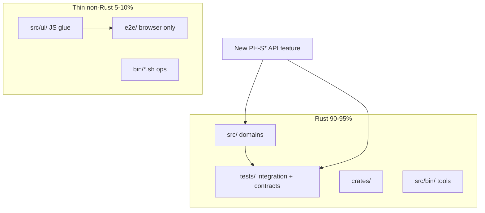

# Rust codebase ratio — стратегія 90–95% (PoolAI)

**Оновлено:** 2026-06-13 · **Канон:** FM **§5.13** · правила [`.cursor/rules/runtime-stack-policy.mdc`](../../.cursor/rules/runtime-stack-policy.mdc), [`.cursor/rules/poolai-testing-policy.mdc`](../../.cursor/rules/poolai-testing-policy.mdc)

**Мета:** зростання частки **Rust** у виконуваному коді репозиторію до **90–95%**, щоб платформа (координатор, worker, API, валідація, тести) **збиралась і перевірялась через `cargo`** на будь-якій ОС/архітектурі без обов'язкового Node на edge-пристрої.

---

## 1. Ціль і вимір

| Показник | Ціль | Коментар |
|----------|------|----------|
| **Rust LOC share** | **90–95%** | `src/`, `tests/`, `crates/`, `src/bin/` |
| **Non-Rust (допустимо)** | **5–10%** | `src/ui/*.js` (glue), `e2e/*.ts` (лише browser), `bin/*.sh` (ops) |
| **Поза ratio** | docs, `.md`, CI yaml, snapshots PNG | не входять у знаменник «коду продукту» |

**Орієнтовний зріз (2026-06-13, PH-S144):** **`91.91%`** Rust LOC у product code (`cargo run --bin poolai-loc-audit` → [`rust_ratio.json`](./rust_ratio.json)). GitHub Languages bar ~**91.9%** Rust (heuristic). Основний «шум» ratio — **vanilla JS** admin panels + **browser-only** `e2e/tests/` (legacy API-smoke archived PH-S144).

**Audit:** `cargo run --bin poolai-loc-audit` — звіт `docs/development/rust_ratio.json` для FM §5.13 / PH-S150 gate.

---

## 2. Портативність «працює де завгодно»

| Шар | Технологія | Пристрої |
|-----|------------|----------|
| **Coordinator / worker / tools** | Rust binaries | Linux, Windows, macOS; ARM/x86; без JVM/Python |
| **HTTP API + business rules** | Rust `src/` | будь-який клієнт (curl, mobile, bot) |
| **Admin UI (поточний)** | HTML + thin JS | будь-який браузер; Node **не** на production host |
| **Admin UI (горизонт PH-S147+)** | **wasm32** modules з shared Rust crate | той самий UI logic на desktop/tablet/embedded browser |
| **Перевірка якості** | **`cargo test-ci`** | dev/CI на будь-якій машині з Rust toolchain |
| **Browser regression** | Playwright (мінімум) | лише CI/dev з Node; не на edge nodes |

**Принцип:** нові можливості — **Rust-first**; JS/TS — лише те, що браузер не отримує з WASM/DOM glue; Node — лише harness для axe/visual/admin smoke.

---

## 3. Піраміда розробки (узгоджено з testing policy)

| Тип задачі | Куди писати | Не робити |
|------------|-------------|-----------|
| API, grid, job, discovery, telegram wire | `src/` + `tests/*_integration.rs` | новий `e2e/tests/*.spec.ts` для HTTP-only |
| Валідація, pricing, trust, locality | `src/grid/`, unit + integration | дубль логіки в JS |
| Admin read-only panel | `src/ui/admin/*.rs` HTML + мінімум JS | великі JS modules |
| DOM / a11y / theme / visual | `e2e/tests/smoke|admin|a11y|visual` | — |
| Shared UI↔server rules | `crates/poolai-ui-core` (PH-S146) → wasm (PH-S147) | copy-paste у TS |

---

## 4. Фази (роадмеп)

| Фаза | Коли | Дія | Ratio |
|------|------|-----|-------|
| **A — freeze** | зараз (PH-S140…S142) | нові API acceptance → Rust tests; UI спринти — thin JS | утримати ≥88% |
| **B — dedupe** | §5.13 PH-S144…S145 | перенести legacy API Playwright → Rust; HTTP stand smoke bin | +3–5% |
| **C — UI core** | PH-S146…S147 | shared Rust crate + wasm32 POC для admin helpers | +2–4% |
| **D — slim e2e** | PH-S148 | `e2e/` лише smoke/admin/a11y/visual; прибрати API specs з `test:ci` | +1–2% |
| **E — gate** | PH-S150 | CI advisory якщо ratio <88%; target 90% | стабільно 90–95% |

**Черга §5.12 (3 відкритих)** закривається **до** старту §5.13 — без змішування scope.

---

## 5. FM §5.13 — черга після PH-S142

| # | Sprint | Фокус | Acceptance |
|---|--------|--------|------------|
| 1 | **PH-S143** | LOC ratio baseline audit | `cargo run --bin poolai-loc-audit`; [`rust_ratio.json`](./rust_ratio.json) **91.48%**; FM оновлено | **✅** |
| 2 | **PH-S144** | Playwright API → Rust migration | `jobs_lease`, `grid_*`, `protocol_middleware`, `telegram_wallet`, `jobs_migrating` покриті integration; Playwright specs archived або deleted | **✅** |
| 3 | **PH-S145** | `poolai-http-stand-smoke` bin (Rust) | `reqwest` + stand env; RUN_LOCAL doc; `--raid` + `POOLAI_E2E_STAND_ROOT` | **✅** |
| 4 | **PH-S146** | `crates/poolai-ui-core` stub | shared validators/formatters з admin JS винесені в Rust crate + unit tests | **✅** |
| 5 | **PH-S147** | wasm32 admin core POC | один panel helper compiled to wasm; docs portability §2 |
| 6 | **PH-S148** | Slim `e2e/` | `test:ci` без API patterns; ratio ≥90% |
| 7 | **PH-S150** | Ratio CI advisory | workflow крок або bin exit 1 якщо <88% (warn), target 90% |

*(PH-S149 — portable deploy matrix docs — можна в PH-S147 docs-sync.)*

---

## 6. Правила агента / VDT (коротко)

1. **Новий PH-S* (API):** `tests/` + `cargo test-ci` — див. [`poolai-testing-policy.mdc`](../../.cursor/rules/poolai-testing-policy.mdc).
2. **Replenish §5.12:** пріоритет code-first Rust; Playwright — лише якщо acceptance явно вимагає browser.
3. **Після PH-S142:** replenish з **§5.13**, не з нових Playwright API specs.
4. **MSYS2:** `export PATH="$HOME/.cargo/bin:/ucrt64/bin:/usr/bin:$PATH"` — для UI E2E; API scope — лише `cargo`.

---

## 7. Пов'язані документи

| Документ | Роль |
|----------|------|
| [`FUNCTION_MANAGEMENT.md`](../catalog/FUNCTION_MANAGEMENT.md) §5.12, **§5.13** | черги PH-S* |
| [`GALAXY_GRID_ROADMAP_2026-05-27.md`](./GALAXY_GRID_ROADMAP_2026-05-27.md) | Galaxy + ratio фази |
| [`NEXT_STEPS_ARCHITECT_2026-03-17.md`](./NEXT_STEPS_ARCHITECT_2026-03-17.md) | **P8** Rust ratio |
| [`E2E_PLAYWRIGHT.md`](./E2E_PLAYWRIGHT.md) | browser-only E2E |
| [`HANDOFF_NEW_SESSION.md`](./HANDOFF_NEW_SESSION.md) | операційний зріз |
